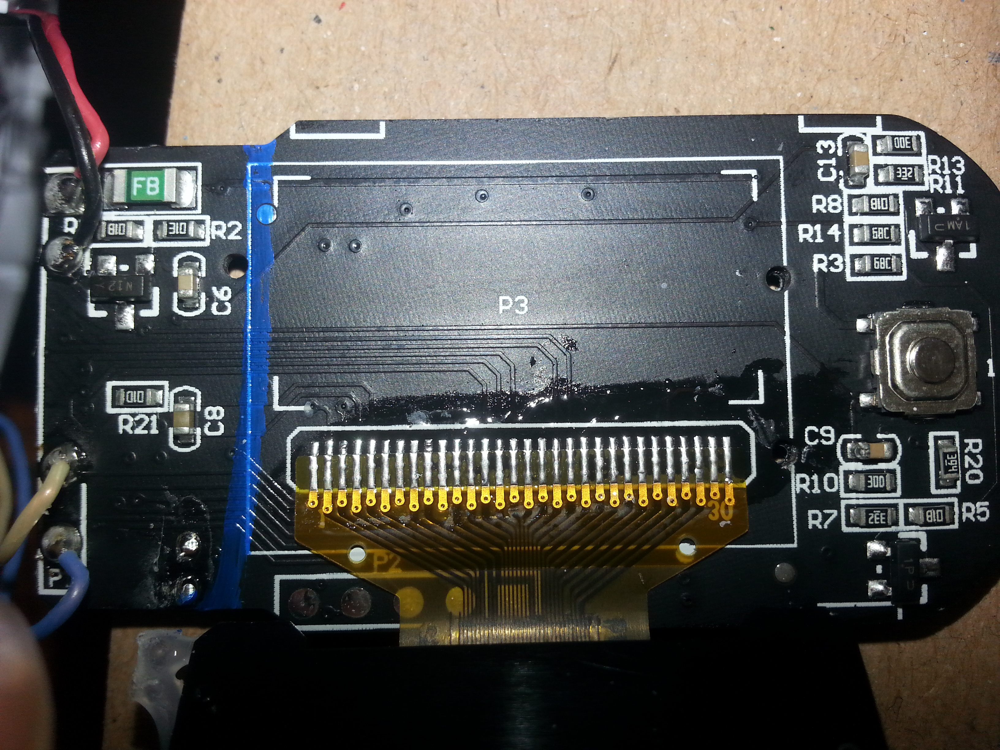
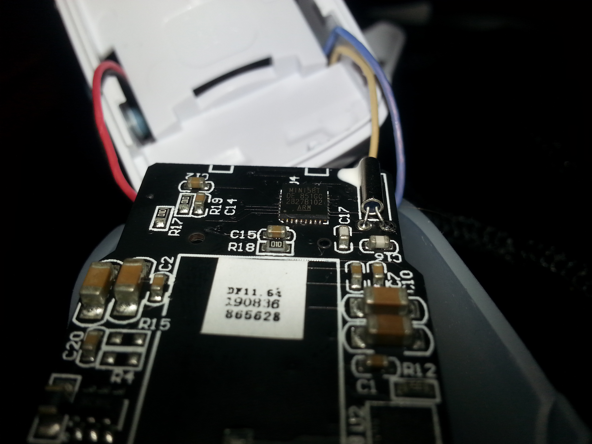
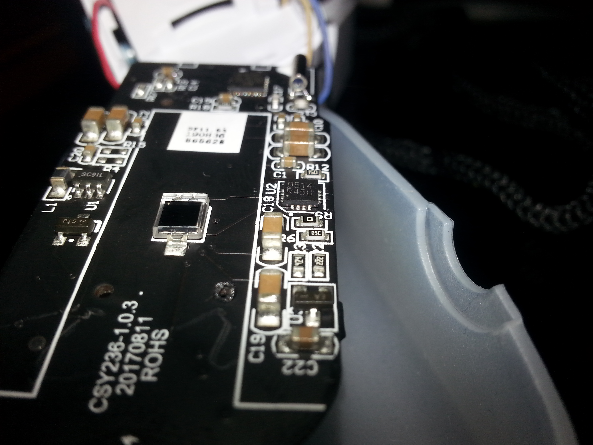
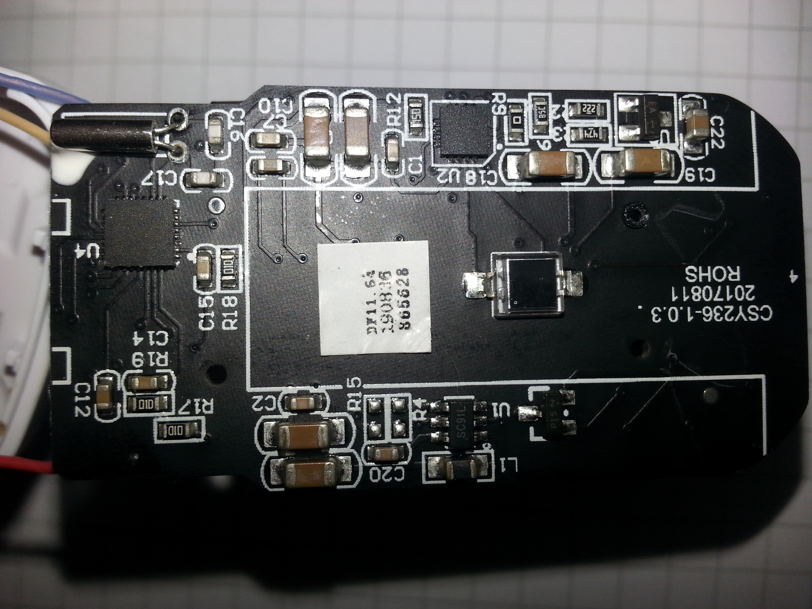
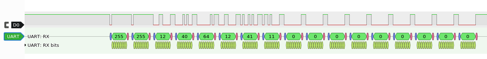
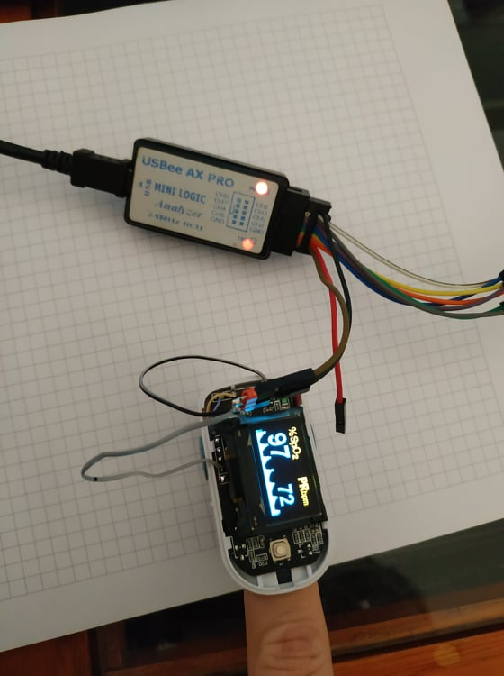
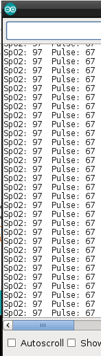
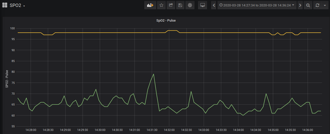

# MD300C29

Fingertip Pulse Oximeter reading data

To get access to pin you only need to dissasemble upper part of device (blue cover)

No finger in device (last two bytes are 0)

Finger (check two last bytes (DEC))

Readings on display (same as two last bytes)

Serial in PulseView is set to 115200

PulseView file is in data folder

CPU datasheet in datasheet folder
